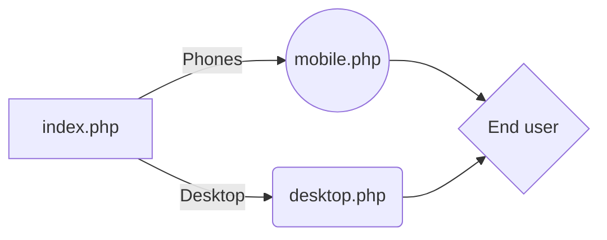

# Welcome to Mobile-php v2.

by NRRINC Media

# How it works:

  



# How to use

You make your Mobile page and your main Desktop page.

  

You set the URL to the File of your Main and Mobile Page.

```php

if ($tablet_browser > 0) {

$device ='<div class="hello"><a href="https://github.com">link inside of a div...</a></div>';

}

else  if ($mobile_browser > 0) {

$device = header('Location: https://domain.com/file/index.php');

}

else {

$device = header('Location: /file/m.php');

}

```

# How to use inside-mobile

  

You use this one if your files are in different parts of the server. (Ex: Index is in /home/cool and the M.php is in /r/cool/files/whyisitgoingthislong)

  

**REMEMBER** This does NOT work with Divs, as They are not files. only use $path for files.

  

```php

<?php

$path = $_SERVER['DOCUMENT_ROOT'];

$path  .=  "/hello/m.php";

include_once($path);

?>

```

*or*

```php

<?php

else {

$device =

$path = $_SERVER['DOCUMENT_ROOT'];

$path  .=  "/beta/cool.php";

include_once($path);

}

?>

```